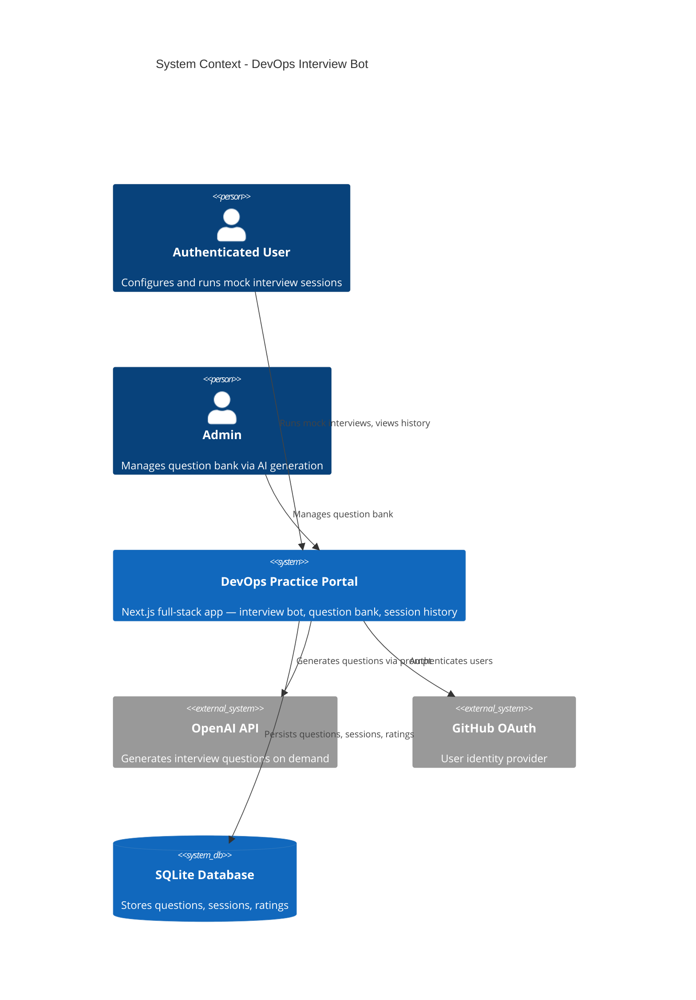

# System Context: DevOps Interview Bot

## Actors

- **Authenticated User** (Human): A logged-in portal user who configures and runs mock interview sessions, reviews answers, self-rates, and views session history
- **Admin** (Human): A privileged user who manages the question bank — triggers bulk AI generation, reviews, approves, or rejects questions
- **Next.js Middleware** (System): Validates JWT on every request, enforces authentication boundary for all routes

## External Systems

| System | Direction | Data Exchanged | Protocol | Risk |
|--------|-----------|----------------|----------|------|
| **OpenAI API** | Outbound | Question generation prompts / generated questions | REST (HTTPS) | High — cost and availability dependency |
| **GitHub OAuth** | Inbound | User identity (token exchange) | OAuth 2.0 | Low — already established |
| **SQLite (Drizzle)** | Internal | All persisted data | ORM queries | Low |

## Data Flows

### Inbound
- User session configuration (topic selection, difficulty, experience level, question count)
- User actions during interview (reveal answer, self-rate, navigate questions)
- Admin commands (trigger generation, approve/reject questions)
- GitHub OAuth token on login

### Outbound
- Interview questions (question text, type, topic, difficulty)
- Answers and explanations (revealed on demand)
- Session records (saved to DB, served to history view)
- Question generation prompts sent to OpenAI API

## Context Diagram

## Boundary Notes

- All routes are behind JWT authentication — no public API surface
- OpenAI key is server-side only; never exposed to the browser
- Question generation costs are admin-triggered (not automatic) to control API spend
- Session data is strictly user-scoped — no cross-user data access
