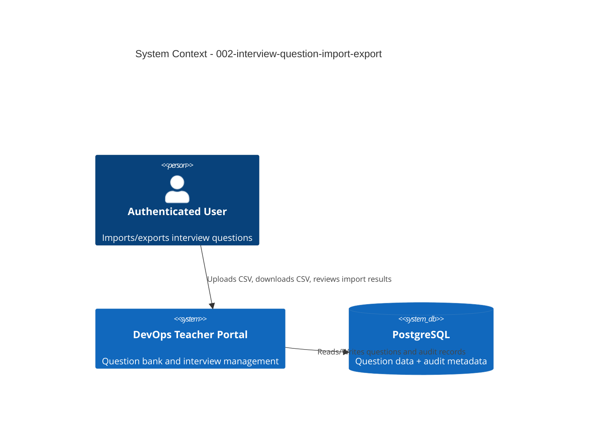

# System Context: Interview Question Import/Export

## Actors

- **Authenticated User** (Human): Imports and exports interview questions for portability and bulk updates.
- **Backend API** (System): Validates payloads, enforces idempotency, persists valid question records.
- **Database (PostgreSQL via Prisma)** (System): Stores question bank records and import/export audit metadata.

## External Systems

| System | Direction | Data Exchanged | Protocol | Risk |
|--------|-----------|----------------|----------|------|
| File Upload Client (Browser) | Inbound | CSV file payload, import mode flags | HTTPS multipart/form-data | Medium |
| File Download Consumer (Browser) | Outbound | CSV export file with question fields | HTTPS | Low |

## Data Flows

### Inbound
- Import request with file content and mode (`dry-run` or `apply`).
- Filter criteria for export (topics, difficulty, experience level, type, status).

### Outbound
- Portable CSV export containing full question schema.
- Validation report with row-level errors and duplicate summaries.
- Import apply summary with inserted/skipped invalid/skipped duplicate totals.

## Context Diagram

## Boundary Notes

- Import/export is available to all authenticated users in this intent scope.
- Idempotency is mandatory: repeated imports of identical logical rows must not insert duplicates.
- Validation must isolate bad data and never persist invalid rows.
