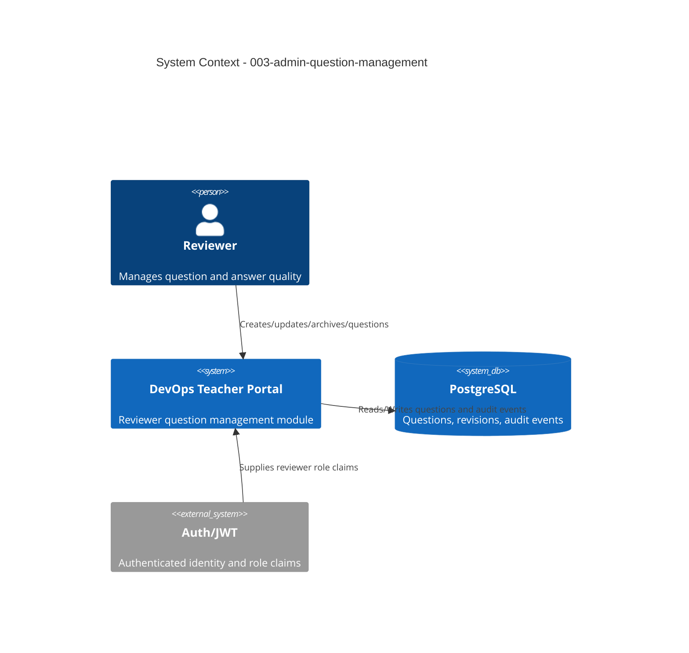

# System Context: Reviewer Question Management

## Actors

- **Reviewer** (Human): Creates, updates, archives, and audits question records.
- **Backend API** (System): Enforces reviewer authorization, validation, stale-write protection, and audit recording.
- **PostgreSQL (Prisma)** (System): Stores question records, revision metadata, and audit events.

## External Systems

| System | Direction | Data Exchanged | Protocol | Risk |
|--------|-----------|----------------|----------|------|
| Web Browser | Inbound/Outbound | CRUD requests, list/filter queries, conflict responses | HTTPS JSON | Low |
| Authentication/JWT layer | Inbound | User identity and role claims (`reviewer`) | Cookie + JWT | Medium |

## Data Flows

### Inbound
- Reviewer list/filter requests with pagination and filters.
- Reviewer create/update payloads including answer and metadata.
- Reviewer delete/archive actions with explicit confirmation.
- Update requests carrying revision token (`updatedAt` or `version`).

### Outbound
- Paginated filtered question lists and full question detail.
- Validation error payloads with field-level messages.
- Conflict responses containing latest persisted record metadata.
- Audit references or operation IDs for create/update/delete actions.

## Context Diagram

## Boundary Notes

- Access is reviewer-only for both UI and API paths.
- Delete path uses soft-delete/archival as default safety posture.
- Stale writes are blocked via conflict detection (optimistic concurrency).
- All mutations must emit immutable audit events.
