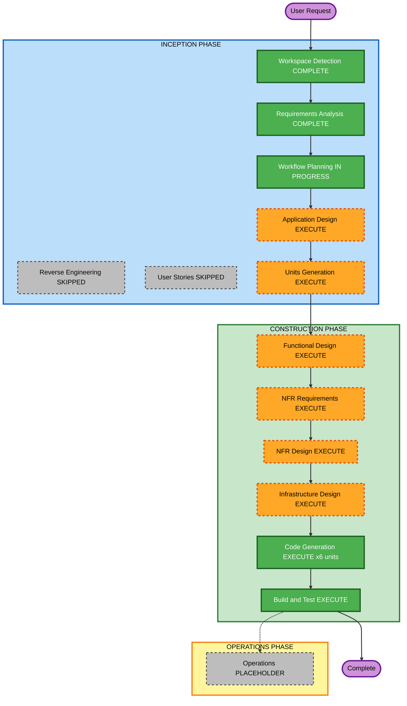

# Execution Plan — DevOps Practice Portal

## Change Impact Assessment

| Area | Impact |
|------|--------|
| User-facing changes | Yes — new web application, all UI is new |
| Structural changes | Yes — new codebase from scratch |
| Data model changes | Yes — 4 new PostgreSQL tables |
| API changes | Yes — 16 new REST endpoints |
| NFR impact | Yes — auth/security, caching, Docker deployment |

## Risk Assessment

| Factor | Rating |
|--------|--------|
| Risk Level | Medium — standard stack, moderate complexity |
| Rollback Complexity | Easy — greenfield, no existing users |
| Testing Complexity | Moderate — auth flow + timer logic need integration tests |

---

## Units of Work

The application decomposes into 6 units implemented sequentially:

| # | Unit | Description |
|---|------|-------------|
| 1 | **setup** | Project scaffolding, Docker Compose, PostgreSQL schema, env config |
| 2 | **auth** | GitHub OAuth (Passport.js), JWT cookies, user model, auth middleware |
| 3 | **content-api** | Backend reads devops-challenges/ markdown, in-memory cache, REST endpoints |
| 4 | **progress** | Progress status CRUD + timed sessions (start/stop/accumulate) + frontend controls |
| 5 | **notes** | Per-exercise notes + global scratch pad CRUD + frontend markdown editor |
| 6 | **frontend-shell** | React + Vite SPA, routing, layout, dashboard home page |

Units 1–5 are backend-first. Unit 6 is the frontend that wires to all backend units.

---

## Workflow Visualization

### Text Representation

```
INCEPTION PHASE
  [x] Workspace Detection          - COMPLETE
  [x] Reverse Engineering          - SKIPPED (greenfield)
  [x] Requirements Analysis        - COMPLETE
  [ ] User Stories                 - SKIPPED (single persona)
  [ ] Workflow Planning            - IN PROGRESS
  [ ] Application Design           - EXECUTE
  [ ] Units Generation             - EXECUTE

CONSTRUCTION PHASE (per unit)
  [ ] Functional Design            - EXECUTE
  [ ] NFR Requirements             - EXECUTE
  [ ] NFR Design                   - EXECUTE
  [ ] Infrastructure Design        - EXECUTE
  [ ] Code Generation              - EXECUTE (all 6 units)
  [ ] Build and Test               - EXECUTE

OPERATIONS PHASE
  [ ] Operations                   - PLACEHOLDER
```

### Mermaid Diagram



---

## Phases to Execute

### INCEPTION PHASE
- [x] Workspace Detection — COMPLETE
- [x] Reverse Engineering — SKIPPED (greenfield, no existing app code)
- [x] Requirements Analysis — COMPLETE
- [x] User Stories — SKIPPED
  - **Rationale**: Single user persona (DevOps learner), requirements are specific and complete
- [x] Workflow Planning — IN PROGRESS
- [ ] Application Design — EXECUTE
  - **Rationale**: New multi-component system needs component boundaries, interfaces, and service layer defined before coding
- [ ] Units Generation — EXECUTE
  - **Rationale**: 6 distinct implementation units, each independently deliverable

### CONSTRUCTION PHASE (per unit)
- [ ] Functional Design — EXECUTE
  - **Rationale**: New data models (4 tables), session timer business logic, OAuth token lifecycle all require design
- [ ] NFR Requirements — EXECUTE
  - **Rationale**: Security is critical — JWT cookie strategy, OAuth callback, CORS, read-only content API
- [ ] NFR Design — EXECUTE
  - **Rationale**: Flows from NFR Requirements; caching pattern, auth middleware design
- [ ] Infrastructure Design — EXECUTE
  - **Rationale**: Docker Compose service definitions, PostgreSQL schema, env var mapping, VPS setup
- [ ] Code Generation — EXECUTE (6 units)
  - **Rationale**: Always executes; generates all application code, config, and tests
- [ ] Build and Test — EXECUTE
  - **Rationale**: Always executes; build instructions + test suite for the full stack

### OPERATIONS PHASE
- [ ] Operations — PLACEHOLDER

---

## Success Criteria

- User can sign in with GitHub and see their personalised dashboard
- All 80 exercises are browsable and readable (markdown rendered)
- Progress status and timed sessions persist across devices
- Notes (per-exercise and global) save and load correctly
- Application starts from scratch with `docker-compose up`
